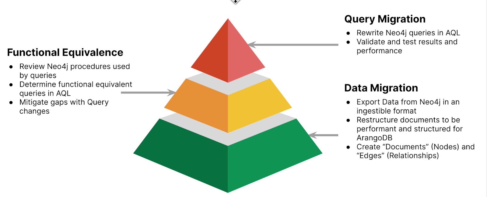
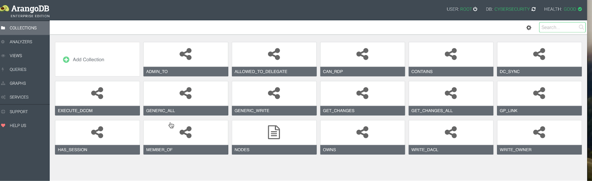

# **Neo4j to ArangoDB Toolkit**

1. **Executive Summary**

This document outlines the steps required to migrate from Neo4j to Arango. There are various ways to undertake the end-to-end migration. This document outlines one such way, using a provided toolkit. The toolkit allows you to migrate the data from Neo4j to ArangoDB and also simplifies query conversion using LLMs.

2. **Phases**
**There are typically 4 phases of migration (in order):**

   1. **Data Migration:** Migrating the data from Neo4j to ArangoDB
   2. **Functional Equivalence:** This is generally a manual process of identifying equivalent queries, functions, and procedures to migrate queries from Neo4j to ArangoDB
   3. **Query Migration:** Converting queries from Neo4j Cypher to ArangoDB AQL. Note that the query conversion is never 100% automated. In general, LLMs provide the constructs and foundation to get you 80-90% there. Nuances with your workload and query patterns require fine-tuning. Further tuning/refining is required to validate and test the queries to get the performance you need.
   4. **Application Migration:** This phase involves changing the application code. Both Neo4j and ArangoDB support a wide variety of programming languages, and the semantics and use of the API vary by SDK. Again, this is a manual effort and cannot be fully automated.

This toolkit addresses only the first three components. Application migration is not covered as a part of this toolkit.





**Figure 1.0 - Migration Stages**


3. **Complexity and Effort**

In our experience, the migration effort varies by the complexity of the document model, the queries, and the use case. Because of ArangoDB's multi-model architecture, the data migration is generally the least complex part of the migration. Additionally, query conversion can be significantly simplified using Generative AI and LLM.


4. **The Toolkit**

## What’s Included 

1. **config.ini**- used by neo4j2Arango.py to ingest data into your Arango instance
2. **Cypher_To_AQL_OpenAI.ipynb** - Jupyter notebook for converting Neo4J Cypher to ArangoDB AQL
3. **neo4j2Arango.py** - A Python script for ingesting the exported Neo4J data
4. **README.md** - Read this for more information on running this tool

[Click here](https://github.com/arangodb/Neo4j-Arango-Migration) to access all the above files in the Toolkit.


## Prerequisites

The current version of the Neo4j migration script leverages the JSON dump using the APOC library. The following steps (as shown in Figure 2.0 below) must be followed before exporting the data using the library:


1. Copy the apoc jar from the labs director to the plugin directory
2. Create and apoc.conf in the conf directory with the following values

    ```
    apoc.export.file.enabled=true
    apoc.import.file.use_neo4j_config=false
    ```


**Figure 2.0 - Pre-export steps**

## Data Migration

The following steps are required to migrate the data from Neo4j to ArangoDB. These steps are highlighted in this video.

### Export Data from Neo4j
1. Login into neo4j explorer
2. Switch into the database you want to export


**Figure 3.0 - Neo4j Query Console**

3. Run the apoc export command to export the data to json.

    ```
    CALL apoc.export.json.all("<Your Export Path>/cybersecurityexport.json",{useTypes:true})
    ```


**Figure 4.0 - After Running Export**

  **_Note: Neo4j browser does not support relative paths or the use of ~ (tilde) i.e. home directory in the APOC call you have to explicitly specify the full path_**

4. Validate the exported results using a tool such as [jq](https://jqlang.github.io/jq/) or an editor of your choice.

### Import Data Into ArangoDB

1. **Prior to running the script** (neo4j2Arango) to import the data, you need to set up an ArangoDB instance where you will import the data.
2. **Override** the following settings in the config.ini file.

    ```
    [Database]
    #Comma separate list of coordinators or the loadbalancer itself
    endpoints=<cluster endpoint http(s)://<hostname>:<port>
    username = <user>
    Password = <password>

    [Source]
    data_file = <exported json file>

    [Sink]
    database =  recommendations
    node_collection = NODES

    [Processing]
    #Be VERY VERY Careful
    drop_database = True

    # Node modes
    # Mode #1: One node collection for each label (duplicates the entire data per node label)
    # Mode #2: Only one node collection, all nodes are in a single collection called nodes
    # Mode #3: Both i.e. write both 1 and 2
    # Edge relationships are created based on the mode
    node_mode = 3

    batch_size = 20000
    skip_nodes = False
    skip_edges = False
    skip_edge_nodes = False
    ```
3. **Node Ingestion**

    There are three node ingestion modes that are provided as flexible approaches to work around Neo4j’s lack of support for a complete Document structure/collection, as provided by ArangoDB.

    1. **Mode 1:** One node per label, this duplicates the node into a new collection per unique label. This is great for debugging. The _key remains the same, the _id are however different based on the collection prefix. The edges are prefixed by the &lt;from collection>-&lt;to collection> of the collections in the relationship. The label attribute contains an array of all the labels.
    2. **Mode 2:** There is only one vertex/node collection. The nodes are not duplicated. The label attribute contains an array of all the labels. The edges are always between the node collection to itself.
    3. **Mode 3:** This is a hybrid mode that creates both a unique collection per label as well as a single collection for all nodes. The edge collections contain both the edges &lt;from collection>-&lt;to collection> as well as the edge from the single collection containing all the nodes.

    Currently, **Mode 1** and **Mode 3** both duplicate nodes in multiple collections for each label; **Mode 3** creates only a single collection for nodes. The duplicate nodes are not recommended for production use. They are simply used to allow you to refactor your document model, and are provided for convenience. 

    **_Note: If you only have a single label per node then Mode 2 is all you need_**

4. **Modeling & Refining the Data**

    Now that the data is in ArangoDB, it’s important to choose the best document modeling approach based on your use case. Depending upon the use case and how the labels are associated with each vertex, the next step is to determine a hierarchy, inheritance, and/or type of (for each node) and then refactor the nodes accordingly. 

    For example, in Neo4j’s recommendations data set, a **Person** could be a **Director, an Actor, or both**. So instead of creating only a single collection called node - or duplicating the data by creating three different collections for Person, Actor and Director - you would “normalize” to the Person collection. 


    It’s challenging to make such an implementation generic, but you can customize the script to your needs or refactor the documents after the duplicate ingestion is completed.


    You could use **Mode 1** and then delete all the unneeded node collections. For example, after you have created the Person collection and added appropriate labels, you can delete the **Actor** and **Director** documents. You will need to update all the edges in the ACTED_IN and DIRECTED collections to now reference the **Person** collection instead of the **Actor** and **Director** collections.  


    When using **Mode 1**, there are two options for how to modify the edges.


   **Option 1:** Separate distinct types of objects (refactoring after ingestion using Mode 1)


            


  **Option 2:** Normalized objects to parent type with different labels


        


5. Once you have the configuration setup correctly, run the script to ingest the data into ArangoDB:

    ```python3 neo4j2Arango.py```

6. This script will summarize the number of nodes and edges imported. Here is what a sample output looks like. 

    ```
    Summary:
    Inserted 28863 nodes as raw nodes
    Inserted 332522 nodes via relationships
    Inserted 383087 as edges
    ```

7. Validate the numbers based on your data in Neo4j and you’re done!


### Visual Verification 

The script automatically creates a graph in ArangoDB based on the relationships found. You may need to change the label and node colors in the visualizer to inspect the nodes and the data more easily.


1. Neo4j visualizer

    


**Figure 5.0 - Neo4j Visualizer**


2. Visually verify the relationships and nodes are as expected in ArangoDB. You can check the node and the edge counts in the respective collections

    



**Figure 6.0 - Visual verification of collections (Edges and Vertices)**


3. Check ArangoDBs Graph.  **Note: **While migrating the data, you will see duplicate nodes depending upon the node_mode selected in the configuration.

    


**Figure 7 .0 - ArangoDB Visualization**


## Functional Equivalence

ArangoDB may not have fully functional equivalent procedures that Neo4j provides, most common queries however can easily be implemented using various query options that ArangoDB provides. For example, spanning tree can be accomplished using breadth-first search and globallyUniqueVertices with the OPTIONS you can provide in queries. 

```
   OPTIONS {uniqueVertices: "global", order: "bfs"}
```


In some cases, no direct functional equivalent option exists, in which case you may have to implement the logic using different queries, Foxx services, or on the application side instead of the database.

Please see this video for more details on Functional Equivalence. A list of all supported AQL functions can be found [here](https://docs.arangodb.com/3.12/aql/functions/) .

If you have any questions about how to accomplish specific queries or features using ArangoDB, please contact our [community](arangodb-community.slack.com) or [support channels](https://arangodb.atlassian.net/servicedesk/customer/portals).


## Query Conversion and Tuning

You need a subscription/key to ChatGPT to utilize this portion of the toolkit.  The steps are highlighted in this video.

To get a list of your queries, there are typically 3 ways to do it:

1. Enable the Neo4j query log (Enterprise version only). The instructions can be found [here](https://neo4j.com/docs/operations-manual/current/monitoring/logging/)
2. Parse them from your application code
3. If you have all the queries externalized to a configuration file, you can use the config(s) to get them.

The Neo4j query log is by far the easiest method to get the logs, you may need to run a workload or keep the application running for a while to consolidate all the queries and then de-duplicate them.

Please reference the [provided jupyter notebook](https://github.com/arangodb/Neo4j-Arango-Migration/blob/main/Cypher_To_AQL_OpenAI.ipynb) on how to train / fine-tune your Chat GPT 3.5 mode. 

**Note:** ChatGPT is not going to be 100% perfect at the start. You can, however, continue to fine-tune the model and improve the query conversion for your use cases. 

You can provide examples and ground truth (which could be manually converted queries). Over time, this will improve your query conversion from Neo4J Cyper to ArangoDB.


**Figure 8.0 - ChatGPT Converting a Cypher query to AQL**


5. **Limitations**
    1. This toolkit does not cover application migration / sdk related changes. Migrating from Neo4J’s sdk to ArangoDB’s driver will need to be done based on the language of your choice.
    2. APOC and other procedures may or may not have equivalent alternatives in ArangoDB.
    3. The toolkit only provides data migration using the apoc json dump; other migration alternatives may exist, such as CSV export or streaming changes. The provided toolkit logic can be reviewed to customize the ingestion per your needs.

6. **Conclusion**

Migrating the Data and Queries is only one part of the Neo4j to Arango migration. As with any database, you need to functionally test your queries and ensure that they are returning the intended results. 

Once your functional testing is complete, invest time in performance-tuning your queries using indexes and query optimizations. For assistance, reach out to your ArangoDB Account Executive or ping us on the [Arango Slack channel](https://join.slack.com/t/arangodb-community/shared_invite/zt-2d4p43cma-flyf72j9a9wq4A2OtuMFkA).

Data Migration is as much an art as it is a science. Following a methodical approach to migrating your data, testing it, and deploying it will minimize risks and unknowns.


7. **How to Get Help**

You have various ways to get help using the toolkit:


1. You can reach out to our sales team via the [Contact Us](https://arangodb.com/contact/) form on the arangodb.com website
2. You can get help via the [community](https://arangodb.com/community/) via groups, stack overflow or our Slack channel
3. If you are an enterprise customer, you can [raise a ticket](https://arangodb.atlassian.net/servicedesk/customer/portal/11) requesting help
